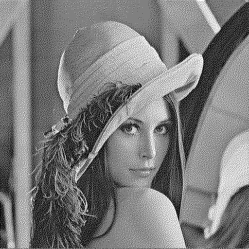

# Multimedia Signal Processing

This project comes from the multimedia signal processing course at National Taiwan University of Science and Technology. This project contains four themes : 
    
* Neighborhood Process - Error Diffusion
* Huffman Coding
* Point Process-Ordered Dithering
* Vector Quantization
* 2D Discrete Cosine Transform

# Experiments

**This image is original ena as a control group.**

</img>

## - Point Process-Ordered Dithering
Using the Classical-4 & Bayer-5 Dither Array.

**Classical-4**

</img>

**Bayer-5**

</img>

## - Neighborhood Process – Error Diffusion
Using the Floyd_Steinberg, Jarvis and Stucki.

**Floyd_Steinberg**

</img>

**Jarvis**

</img>

**Stucki**

</img>

## - Huffman Conding

Huffman code is a particular type of optimal prefix code that is commonly used for lossless data compression. There is the example image to show how huffman coding work.

**Example Image**

</img>

## - Vector Quantization

This project includes the implementation of Vector Quantization(VQ). The block size are 4*4 and implement with for 4 different codebook size image are shown below:

**Codebook Size = 16**

</img>

**Codebook Size = 64**

</img>

**Codebook Size = 256**

</img>

**Codebook Size = 1024**

</img>

## - 2D Discrete Cosine Transform
Including 3 different block size with Spatial Domain image, Frequency Domain image and DCT.

</img>